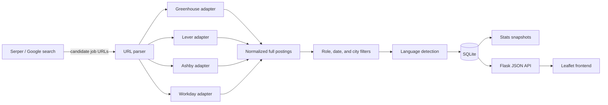

# Job Language Trends

Job Language Trends tracks software-engineering postings across North American cities and estimates programming-language demand from the full text of each job description. It combines Google-based discovery, public applicant-tracking-system (ATS) endpoints, an incremental SQLite dataset, and a Flask frontend.

The project is intended to answer questions such as:

- How many software-engineering jobs are appearing in each city?
- Which programming languages are mentioned most often overall and by city?
- Which job titles are most common?
- Which individual postings contribute to each city's statistics?

This is a market-signal tool, not a complete census of every available job. Google indexing, result ranking, ATS behavior, and the project's filters all affect coverage.

## Quick Version of Running the Data Pipeline

Update all tracked cities:

```bash
python google_language_trends.py --insecure
```

## Architecture



The normal workflow is:

1. `google_language_trends.py` builds one Google query per city, restricted to the four supported ATS domains.
2. Serper returns indexed job-posting URLs. Serper is a paid/free-quota Google Search API; it is the only component that consumes search credits.
3. `ats_job_search.py` parses each URL into a platform, employer board, and stable job key.
4. The corresponding public ATS endpoint returns the complete job description. These requests do not consume Serper credits.
5. The posting is normalized and filtered by role, date, and city.
6. `language_detect.py` detects language mentions in the title and full description.
7. New postings are appended to `job_trends.db`; aggregate city/language counts are recalculated from the accumulated postings.
8. `app.py` reads the database and serves the map, statistics, and posting drill-down UI.

## Why These Four Domains?

The project searches these hosted job-board domains:

```text
lever.co
greenhouse.io
jobs.ashbyhq.com
myworkdayjobs.com
```

These are applicant tracking systems rather than general-purpose aggregators such as Indeed or Dice. Employers publish jobs directly through them. They were selected for several reasons:

- **Full descriptions are publicly retrievable.** Their career pages use public structured endpoints that provide the complete posting without employer API credentials.
- **URLs contain stable identifiers.** The platform, employer board, and job ID can be extracted and used for incremental deduplication.
- **They complement one another.** Greenhouse, Lever, and Ashby are common among technology companies and startups. Workday adds coverage for larger enterprises that are underrepresented on those platforms.
- **They preserve provenance.** Results point to an employer's ATS-hosted posting rather than a copied aggregator listing.
- **They avoid brittle page scraping.** Structured JSON is generally more reliable than extracting descriptions from arbitrary HTML.

All four domains are combined into one Google query per city to conserve Serper quota. This is cheaper than giving each platform its own query, but Google's limited result slots may favor one platform over another. A platform-specific audit can be run with `--sites`, for example:

```bash
python google_language_trends.py --sites myworkdayjobs.com --insecure
```

Workday receives slightly different treatment internally. Its Google-discovered URL is resolved directly through the posting's public CXS detail endpoint, and city validation uses Workday's structured location field. This avoids both crawling a large employer's entire board and accepting a job merely because another city is mentioned in its description.

## Key Files

| File | Responsibility |
|---|---|
| `google_language_trends.py` | Main incremental pipeline: discovery, filtering, persistence, reports, and exports. |
| `google_job_search.py` | Serper client and construction/batching of Google `site:` queries. |
| `ats_job_search.py` | ATS adapters, URL parsing, normalization, role/date/city filters, and full-description retrieval. |
| `language_detect.py` | Shared language vocabulary, detection, counting, and ranking logic. |
| `trends_db.py` | SQLite schema and persistence helpers. |
| `trends_stats.py` | Overall/per-city statistics and stable text/JSON snapshots. |
| `app.py` | Flask application and JSON API. |
| `templates/index.html` | Frontend document structure. |
| `static/js/app.js` | Leaflet map, city labels, API calls, charts, and modal behavior. |
| `static/css/style.css` | Responsive light-mode presentation. |
| `language_trends.py` | Optional comparison pipeline that crawls a fixed employer list without Google. |
| `ats_companies.json` | Employer boards used by the fixed-company crawl. |
| `discover_ats_companies.py` | Occasional Serper-assisted discovery of employer boards for `ats_companies.json`. |

## Data Model

The default database is `job_trends.db` in the project root. Set `JOB_TRENDS_DB` to use another path, such as a mounted production disk.

The main tables are:

- `postings`: normalized job data, full descriptions, detected languages, platform, city, source, and timestamps.
- `cities`: one summary row per `(city, source)`, including total postings and the latest fetch watermark.
- `city_language_counts`: ranked language counts and percentages per `(city, source)`.

Data is separated by source:

- `google`: postings found through the normal Google/Serper pipeline. The frontend currently reads this source.
- `ats`: postings found by the optional fixed-company crawl.

The Google pipeline is append-only for accepted postings. It keeps accumulated job history rather than deleting older or subsequently closed jobs. Statistics, map totals, rankings, and frontend posting lists use only postings whose advertised date falls within the rolling past six calendar months. Older postings remain in `postings` for history and URL deduplication but do not contribute to current statistics. The project does not currently track a separate run-history table or actively retire closed postings.

## Incremental Updates

Each city is updated independently:

- The first fetch uses `--since-date` as its lower bound (default: `2026-01-01`).
- Later fetches resume from that city's last update with a three-day lookback.
- The overlap protects against jobs that Google indexes after their advertised posting date.
- Stable platform/job keys prevent duplicate storage during the overlap.
- Language counts are recalculated over the city's rolling six-month set after each update. The complete accumulated set remains stored.

A job newly discovered today may have an older `posted_at` value. "New this run" means newly added to this dataset, not necessarily advertised in the last 24 hours.

`posted_at` comes from the normalized ATS payload rather than the date Google discovered the URL. Workday uses `startDate`, Lever uses `createdAt`, Ashby uses `publishedAt`, and Greenhouse uses `first_published` when available with `updated_at` as a fallback. Daily posting activity should therefore be treated as an informative ATS-advertised-date trend, not a precise measurement of when every employer first created a requisition.

The six-month cutoff is inclusive and calendar-based. For example, on July 31 the active window begins January 31. API and frontend statistics are calculated dynamically from `postings`, so a job ages out of displayed statistics even if no new fetch runs that day.

## Local Setup

The project is currently developed with Python 3.13, but it uses standard Python/Flask APIs and should work on a recent Python 3 release.

Create and activate a virtual environment, then install dependencies:

```bash
python -m venv .venv
source .venv/bin/activate
python -m pip install -r requirements.txt
```

Create a `.env` file in the project root:

```dotenv
SERPER_API_KEY=your_serper_api_key
```

Obtain a key from [serper.dev](https://serper.dev/). Do not commit `.env`; it is ignored by Git.

### SSL note

Some corporate networks or local certificate configurations cause HTTPS verification failures. In that environment, use:

```bash
python google_language_trends.py --insecure
```

`--insecure` disables TLS certificate verification and should only be used when necessary. Appending `2>/dev/null` hides SSL warnings, but it also hides real errors and is not recommended for routine debugging.

## Running the Data Pipeline

Update all tracked cities:

```bash
python google_language_trends.py --insecure
```

Update selected cities:

```bash
python google_language_trends.py \
  --cities "new york,san francisco,toronto" \
  --insecure
```

Useful options:

```text
--sites                 Comma-separated discovery domains
--since-date            Initial-fetch floor for cities not already in the DB
--title-include         Required title phrases
--title-exclude         Rejected title phrases
--max-pages             Maximum Serper pages per site-query batch
--site-batch-size       Number of domains combined into each Google query
--no-city-filter        Trust Google's city match without local validation
--no-postings           Store aggregate counts without full posting rows
--no-db                 Write exports only; disables incremental DB behavior
--db-path               Use a specific SQLite file
```

The default tracked set contains 25 cities:

```text
Atlanta, Austin, Boston, Charlotte, Chicago, Dallas, Denver, Houston,
Los Angeles, Memphis, Miami, Minneapolis, New York, Philadelphia,
Phoenix, Portland, Raleigh, Salt Lake City, San Diego, San Francisco,
San Jose, Seattle, St. Louis, Toronto, Washington DC
```

Edit `DEFAULT_CITIES` in `google_language_trends.py` and add coordinates to `CITY_COORDS` in `app.py` when adding a city permanently.

## Outputs and Statistics

Each pipeline run refreshes:

```text
data/latest_stats.txt
data/latest_stats.json
```

It also creates timestamped exports:

```text
data/google_language_trends_<timestamp>.json
data/google_language_trends_<timestamp>_by_city.csv
data/google_language_trends_<timestamp>_matrix.csv
```

Print statistics directly from SQLite:

```bash
python trends_stats.py
python trends_stats.py --top 5 --titles 20
```

Job titles are counted as exact strings. Similar titles are intentionally not normalized yet.

## Running the Frontend

Start the Flask development server:

```bash
python app.py
```

Open [http://127.0.0.1:5000](http://127.0.0.1:5000) in a browser. Keep the terminal process running while using the app.

Use another port if necessary:

```bash
python app.py --port 8000
```

The frontend provides:

- A Leaflet map with posting totals for each city
- A shared date-range control with 1D, 7D, 6M, 12M, YTD, ALL, and custom dates; 6M remains the default. The inclusive 1D range covers yesterday through today.
- An overall language ranking and top job titles
- City modals with local language rankings and underlying job links
- Collapsed overall and per-city daily posting activity charts for the latest 30 days
- Per-city CSV downloads containing the past six months of job details

API routes:

```text
GET /
GET /api/stats
GET /api/cities
GET /api/city/<name>
GET /api/city/<name>/postings.csv
```

The JSON and CSV endpoints accept the same optional date-range query parameters used by the frontend:

```text
?range=1d
?range=7d
?range=6m
?range=12m
?range=ytd
?range=all
?range=custom&start=2026-07-01&end=2026-07-31
```

Date bounds are inclusive and interpreted as UTC calendar dates. Omitting `range` uses the rolling six-month default. Changing the frontend selection updates map totals, overall statistics, city details, posting activity, posting lists, and CSV downloads together; retained database history is not modified.

Leaflet and the CARTO basemap are loaded from external services, so the map requires internet access even when Flask is running locally.

## Optional Fixed-Company Pipeline

`language_trends.py` is an alternative data source. Instead of Google discovery, it crawls the employer boards listed in `ats_companies.json` through the same public ATS APIs.

```bash
python language_trends.py --insecure
```

This path avoids Serper costs and is useful for methodological comparisons, but its coverage is limited to known employers. It writes rows with `source='ats'`; the web app currently displays only `source='google'`.

Use `discover_ats_companies.py` when intentionally expanding the fixed employer list. It consumes Serper quota and is not part of the normal daily update.

## Production Configuration

The app is prepared to run behind Gunicorn:

```bash
gunicorn app:app
```

Relevant environment variables:

| Variable | Purpose |
|---|---|
| `SERPER_API_KEY` | Required by discovery/update jobs. |
| `JOB_TRENDS_DB` | SQLite path; use a persistent mounted disk in production. |
| `HOST` | Host used by `python app.py`; defaults to `127.0.0.1`. |
| `PORT` | Port used by `python app.py`; defaults to `5000`. |

A production deployment needs both:

1. A web service running `gunicorn app:app`.
2. A scheduled job running `python google_language_trends.py` against the same persistent database.

SQLite is appropriate for one web instance and one coordinated update process. Before horizontally scaling the web or worker tier, migrate the shared state to a server database such as PostgreSQL.

## Known Limitations

- Google/Serper results are ranked and capped, so the dataset is not exhaustive.
- Combining four domains into one query conserves quota but can reduce per-platform visibility.
- Google may surface a posting days after its advertised date.
- Closed and older-than-six-month jobs remain in the accumulated historical dataset but are excluded from current statistics once their advertised date crosses the rolling cutoff.
- City and title filtering are heuristic. Workday uses structured-location-only matching; other platforms may also use description text to establish city relevance.
- Language detection is phrase-based. It favors understandable, reproducible rules over natural-language inference and intentionally uses conservative phrases for ambiguous names such as Go and R.
- A posting can mention multiple languages, so language percentages do not sum to 100%.
- ATS endpoints are public implementation details and may change without notice.

## Safe Development Practices

- Do not delete `job_trends.db` casually; it contains the accumulated posting history.
- Test a new platform adapter with a platform-only `--sites` run before enabling it by default.
- Inspect accepted locations and URLs, not only aggregate counts.
- Immediately repeat a platform test and verify it adds zero rows; this confirms stable deduplication.
- Keep title and language rules centralized in `ats_job_search.py` and `language_detect.py` so both pipelines remain comparable.
